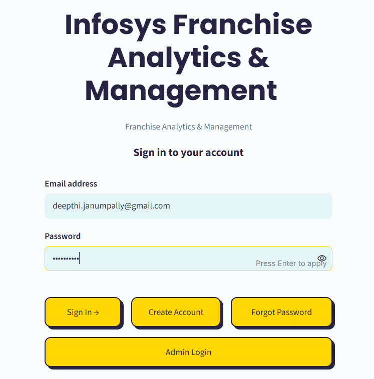
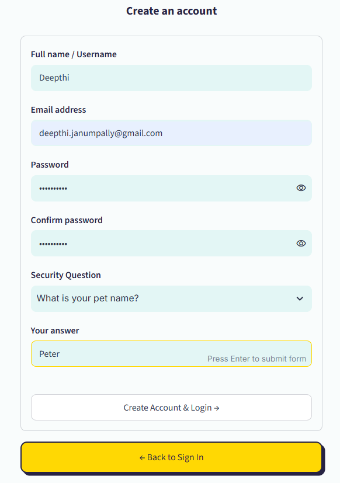
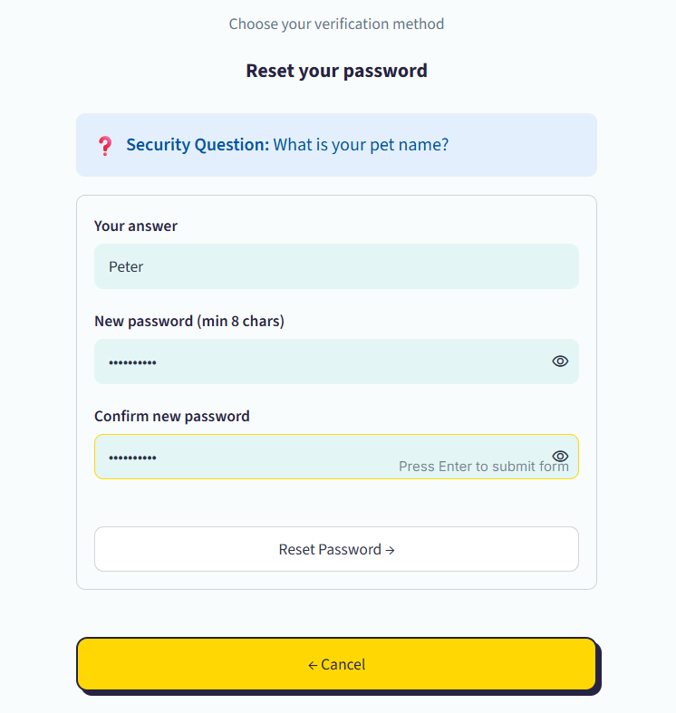
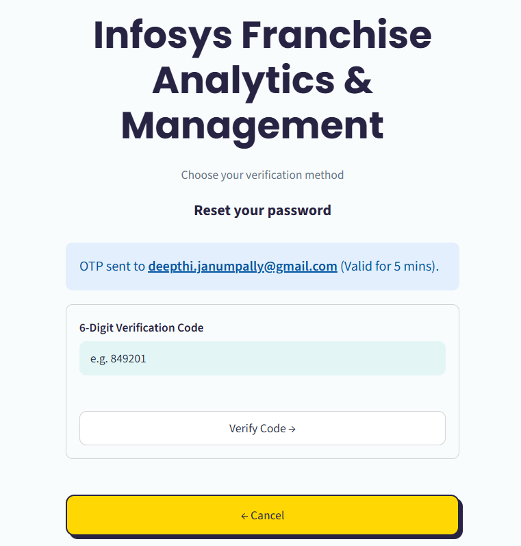
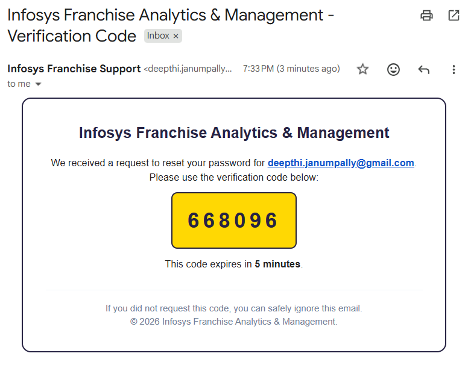
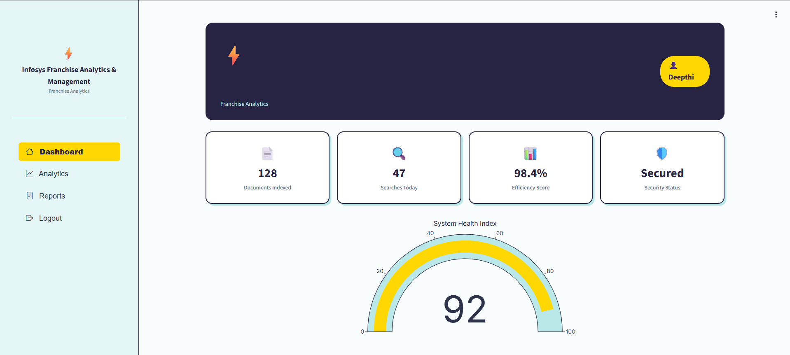
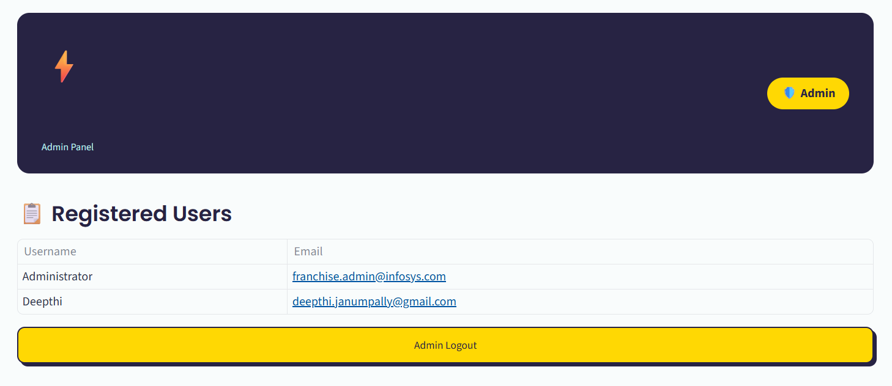

# Infosys Franchise Analytics & Management – Milestone 1

## Project Overview

This repository contains **Milestone 1** of the **Infosys Springboard Virtual Internship 7.0**. As an **AI Intern**, I am developing the **Franchise Analytics & Management** platform – a secure, intelligent portal for managing franchise operations.

This milestone focuses on building a **secure user authentication and management system** using **Streamlit**, **JWT**, and **Gmail OTP**. The application provides:

- **User Authentication** – Sign up, Login, and Session Management with JWT tokens.
- **Password Recovery** – Two secure routes: Security Question and OTP via Email.
- **User Dashboard** – Personalized analytics view after successful login.
- **Admin Dashboard** – Separate login to view all registered users (username and email only).

---

## Features Implemented

### User Authentication
- **Sign Up** – Create account with username, email, security question, and strong password.
- **Login** – Authenticate using email/password; issues a JWT session token.
- **Session Management** – JWT tokens stored in Streamlit's session state and validated on protected pages.

### Password Reset (Two Recovery Routes)
1. **Security Question** – Answer your pre‑set security question to reset password.
2. **OTP via Email** – Receive a 6‑digit OTP to your registered email, verify, and set new password (OTP expires in 5 minutes).

### Dashboards
- **User Dashboard** – Welcome message with analytics visualization (gauge chart for system health).
- **Admin Dashboard** – Separate login with hardcoded credentials; displays all registered users (username and email only – passwords are never shown).

### Security & Validation
- **Mandatory Fields** – All forms require every field to be filled.
- **Email Format Validation** – At least 2 letters before `@`, 2 between `@` and `.`, 2 after the final dot.
- **Strong Password Rules** – Minimum 8 characters, at least one uppercase, one lowercase, one number, and one special symbol.
- **Password Reuse Prevention** – Users cannot reuse a previously used password (stored in password history table).

### OTP Email Delivery
- Uses **Gmail SMTP** with **App Password** to send OTP emails.
- OTP valid for **5 minutes** only.

---

## Tech Stack

| Technology | Purpose |
| :--- | :--- |
| **Python** | Backend logic and API endpoints |
| **Streamlit** | Frontend UI framework |
| **PyJWT** | JWT token generation and verification |
| **bcrypt** | Secure password hashing |
| **SQLite** | Local database (users + password history) |
| **smtplib** | Sending OTP emails via Gmail SMTP |
| **pyngrok** | Exposing the app to the internet |
| **Google Colab** | Development and deployment environment |
| **Plotly** | Dashboard visualizations (gauge chart) |

---

## How to Run

### Prerequisites
- **Google Colab** account
- **ngrok** account (free) – [Get authtoken](https://ngrok.com)
- **Gmail account** with 2‑Step Verification enabled and **App Password** generated

### Step-by-Step Instructions

1. **Open the Colab notebook** provided by your mentor.
2. **Set up Colab Secrets** – Click the key icon (🔑) on the left sidebar and add:

   | Secret Name | Value |
   | :--- | :--- |
   | `JWT_SECRET` | Any long random string |
   | `NGROK_AUTHTOKEN` | Your ngrok authtoken |
   | `EMAIL_ADDRESS` | Your Gmail address (sender) |
   | `EMAIL_PASSWORD` | 16‑character Gmail App Password (no spaces) |

   Toggle **"Notebook access" ON** for each secret.

3. **Run all cells** in order:
   - Installation cell (installs dependencies)
   - `%%writefile app.py` cell (writes the application code)
   - Ngrok runner cell (starts Streamlit and creates public URL)

4. **Copy the public URL** printed in the output (e.g., `https://xxxx.ngrok-free.dev`) and open it in your browser.

5. **Test the application**:
   - Sign up a new user
   - Log in with the new account
   - Use **Forgot Password** to test both recovery routes
   - Click **"Admin Login"** and use `admin` / `admin@123` to view registered users

> ⚠️ **Note**: The app runs only while the Colab notebook is active. Press `Ctrl+C` in the ngrok cell to stop.

---

## Screenshots

All screenshots are stored in the `screenshots/` folder inside `Milestone1`.

| Page | Screenshot |
| :--- | :--- |
| **Login Page** |  |
| **Signup Page** |  |
| **Forgot Password – Security Question** |  |
| **Forgot Password – OTP** |  |
| **OTP Email Received** |  |
| **User Dashboard** |  |
| **Admin Dashboard** |  |

---

## 👤 Admin Credentials

| Login Type | Username / Email | Password |
| :--- | :--- | :--- |
| **Separate Admin Login** (click "Admin Login") | `admin` | `admin@123` |
| **Main Login Admin** (via main login page) | `admin@infosysfranchise.com` | `admin@123` |

---

## 📁 Project Structure
"""
Milestone1/
├── README.md # This file
├── working_model_milestone1.ipynb # Colab notebook
├── infosys_portal.db # SQLite database (auto‑created)
├── screenshots/ # Screenshots folder
│ ├── login_page.png
│ ├── signup_page.png
│ ├── forgot_sq.png
│ ├── forgot_otp.png
│ ├── otp_email.png
│ ├── user_dashboard.png
│ └── admin_dashboard.png
└── .streamlit/ # Streamlit config (auto‑created)
└── config.toml
"""

---

## Final Checklist

- [x] Login, Signup, and Forgot Password (SQ + OTP) fully functional
- [x] JWT session management implemented
- [x] Email format and password validation enforced
- [x] Password reuse prevention (history table)
- [x] User Dashboard and Admin Dashboard working
- [x] OTP emails sent via Gmail SMTP
- [x] All secrets stored in Colab Secrets
- [x] All outputs cleared before submission

---

## License

This project is part of the **Infosys Springboard Virtual Internship 7.0** – AI Intern, Franchise Analytics & Management track.  
For educational purposes only.

---

**Built by Janumpally Deepthi**  
**Infosys Springboard Intern**  
© 2026 Infosys Franchise Analytics & Management
